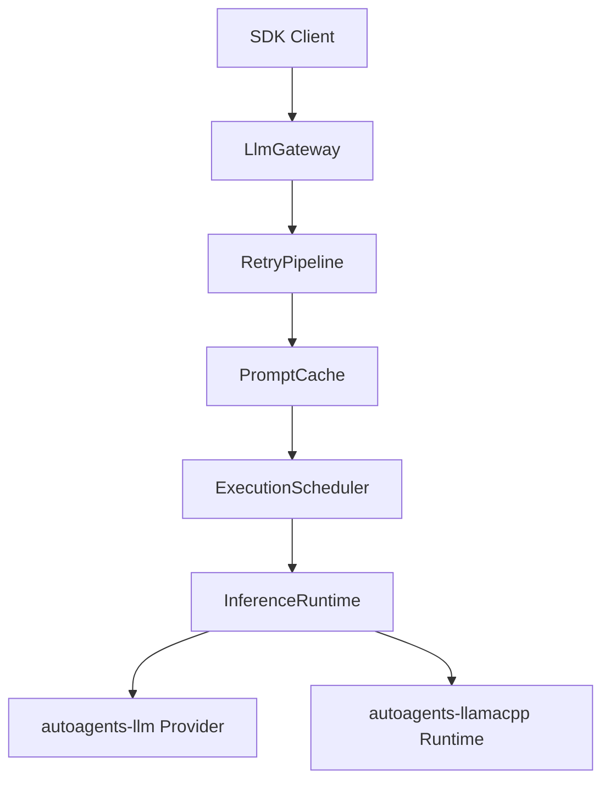

`LlmGateway` owns the runtime components behind an internal shared state:

## Request Flow

1. `chat` enters `RetryPipeline`.
2. The cache checks a canonical key built from route, messages, tools, schema,
   and output-affecting parameters.
3. `ExecutionScheduler` applies queue capacity, per-route concurrency, and
   deadline checks.
4. The request dispatches to a registered runtime or provider.
5. Successful non-streaming responses are stored in `PromptCache`.

`chat_stream` currently returns normalized stream events from a completed chat
response. It does not yet expose provider-native incremental streaming.

## Runtime Boundary

`InferenceRuntime` is the scheduling boundary. Cloud providers use
`ProviderRuntime`. Local llama.cpp models use the feature-gated
`LlamaCppRuntime`.

This keeps scheduling, cache, retry, and telemetry independent from provider
implementation details.
